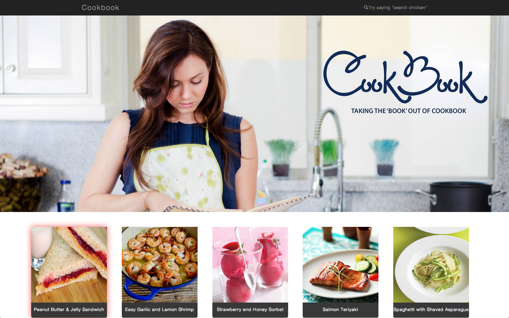

Cookbook! 
=========
Whether you're flipping pancakes for brunch, or preparing a lavish steak dinner, chances are you're following a recipe. We all know cooking get's super messy so you probably won't want to touch anything clean - or your recipe for that matter. Using Leap Motion and voice recognition, Cookbook provides chefs with a hands free recipe following solution!

Note
====
- Swipe left/right to navigate page
- Tap finger towards screen to select recipe
- Swipe left/right to navigate cookbook!

APIs
=========
- [Annyang](https://github.com/TalAter/annyang) voice recognition
- [fullPage.js](https://github.com/alvarotrigo/fullPage.js) for each recipe page
- [leap.js](https://github.com/leapmotion/leapjs) boooom

TODO
====
- ~~simple bootstrap page~~
- ~~leapstrap~~
- ~~test leapstrap swipe function~~
- ~~make pretty~~
- ~~fill pages~~
- Connect to recipe API
